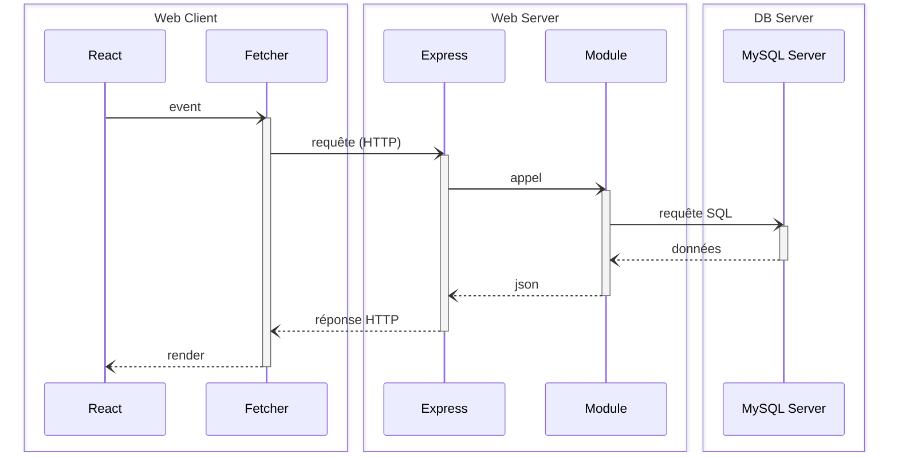

<a href="#fr">
   Français
</a>&nbsp;&nbsp;|&nbsp;&nbsp;
<a href="#en">
   English
</a>

<hr style="margin-top: 4px; margin-bottom: 12px; border: none; border-top: 1px solid #ccc;" />

 Français

<h1>Smart Choice Hub</h1>

Une plateforme web collaborative conçue pour faciliter la prise de décision collective au sein d'un groupe ou d'une organisation.  
Elle permet aux utilisateurs de soumettre des propositions, de les commenter et de suivre leur évolution dans un espace structuré et sécurisé.  
Projet réalisé dans le cadre de la formation DWWM à la Wild Code School, en équipe et selon une méthodologie Agile avec sprints hebdomadaires.

Ce projet est basé sur le monorepo JS proposé par la Wild Code School (v7.1.7), pré-configuré avec des outils de qualité industrielle :
- **Concurrently** : Exécution simultanée de plusieurs commandes dans un seul terminal
- **Husky** : Exécution de commandes spécifiques déclenchées par des événements Git
- **Vite** : Alternative performante à Create-React-App
- **Biome** : Alternative à ESLint et Prettier pour la qualité du code
- **Supertest** : Tests des serveurs HTTP en Node.js

## Schéma visuel de l'architecture du projet (MVC) 



<!--
<div align="center">
  
</div>
-->

<!--
<div align="center">
  
</div>
-->
## Flux de navigation de l'application

<div align="center">
  
</div>
Grâce à cette architecture modulaire et sécurisée, Smart Choice Hub assure une gestion efficace des données, une communication fluide entre le front-end et le back-end, et une évolutivité facilitée pour de futures améliorations.

## Stack

- Client : React + TypeScript + Vite
- Serveur : Node.js + Express + MySQL
- Authentification sécurisée via JWT et hashage argon2
- CSS3 : Styling avec Styled-components
- Hébergement : Frontend sur Netlify, Backend (API & base de données) sur Railway

## Fonctionnalités principales

- Authentification sécurisée avec gestion de session
- Création, consultation, modification et suppression de décisions
- Système de commentaires lié à chaque décision
- Accès restreint à l'application aux seuls utilisateurs connectés
- Interface responsive adaptée aux écrans mobile et desktop
- Affichage de la photo de profil ou d'un avatar par défaut

## Démarrer le projet

### Utilisateurs Windows
Assurez-vous de lancer ces commandes dans un terminal Git pour éviter les problèmes de formats de nouvelles lignes :
```bash
git config --global core.eol lf
git config --global core.autocrlf false
```

### Installation
1. Installez le plugin **Biome** dans VSCode et configurez-le
2. Cloner le dépôt :
   ```bash
   git clone -b dev https://github.com/nadir-ammisaid/Smart-Choice-Hub.git
   cd smart-choice-hub
   ```

3. Installer les dépendances :
   ```bash
   npm install
   ```

4. Configurer les fichiers `.env` :
   * Vous pouvez copier les fichiers `.env.sample` comme modèles (ne les supprimez pas)
   * `client/.env`
     ```
     VITE_API_URL=http://localhost:3310/api
     ```
   
   * `server/.env`
     ```
     DB_HOST=localhost
     DB_USER=root
     DB_PASSWORD=motdepasse
     DB_NAME=smart_choice
     JWT_SECRET=supersecretkey
     FRONT_URL=http://localhost:5173
     ```

5. Lancer le projet :
   ```bash
   npm run dev
   ```

## Arborescence du projet (monorepo)

```
smart-choice-hub/
├── client/
│   ├── public/
│   └── src/
│       ├── assets/
│       ├── components/
│       ├── context/
│       ├── pages/
│       ├── services/
│       └── types/
│   ├── App.tsx
│   ├── main.tsx
│   ├── vite.config.ts
│   └── tsconfig.json
│
├── server/
│   ├── bin/
│   ├── database/
│   │   ├── fixtures/
│   │   ├── client.ts
│   │   └── schema.sql
│   ├── public/
│   │   ├── assets/
│   │   └── uploads/
│   ├── src/
│   │   ├── modules/
│   │   │   ├── auth/
│   │   │   ├── comment/
│   │   │   ├── item/
│   │   │   ├── request/
│   │   │   └── users/
│   │   ├── types/
│   │   ├── app.ts
│   │   ├── main.ts
│   │   └── router.ts
│   ├── tests/
│   ├── jest.config.js
│   └── tsconfig.json
```

## Routes principales de l'API

| Méthode | Route | Description |
|---------|-------|-------------|
| POST | `/api/login/` | Connexion utilisateur |
| GET | `/api/me/` | Récupération du profil connecté |
| POST | `/api/logout/` | Déconnexion utilisateur |
| GET | `/api/users` | Récupération de tous les utilisateurs |
| GET | `/api/users/:id` | Récupération d'un utilisateur par ID |
| POST | `/api/users/` | Création d'un utilisateur avec hachage du mot de passe |
| PUT | `/api/users/:id` | Modification d'un utilisateur |
| DELETE | `/api/users/:id` | Suppression d'un utilisateur |
| POST | `/upload-avatar/:id` | Upload d'un avatar utilisateur |
| GET | `/api/comments/request/:request_id` | Tous les commentaires liés à une Request |
| GET | `/api/comments/:id` | Un commentaire spécifique |
| POST | `/api/comments/` | Création d'un commentaire |
| PUT | `/api/comments/:id` | Modification d'un commentaire |
| DELETE | `/api/comments/:id` | Suppression d'un commentaire |
| GET | `/api/request` | Liste des demandes (Requests) |
| GET | `/api/request/:id` | Détail d'une Request |
| POST | `/api/request/` | Création d'une Request |
| GET | `/api/request/:id/isPoster` | Vérification : l'utilisateur est-il l'auteur ? |
| PUT | `/api/request/:id` | Édition d'une Request (auth + ownership requis) |
| DELETE | `/api/request/:id` | Suppression d'une Request (auth + ownership requis) |

## Variables d'environnement

### client/.env
```
VITE_API_URL=http://localhost:3310/api
```

### server/.env
```
DB_HOST=localhost
DB_USER=root
DB_PASSWORD=root
DB_NAME=smart_choice
JWT_SECRET=supersecretkey
CLIENT_URL=http://localhost:3000
```

## Sécurité

* Authentification par JWT, stocké en cookie `httpOnly` avec `SameSite=Strict`
* Hashage sécurisé des mots de passe avec argon2
* Middleware `verifyToken` pour protéger les routes sensibles
* Vérification de l'auteur via `isPoster` avant modification ou suppression
* Validation des champs côté client et serveur
* Requêtes SQL préparées via `mysql2/promise` pour éviter les injections

## Auteur

Projet réalisé par [**Nadir AMMI SAID**](https://www.linkedin.com/in/nadir-ammisaid/) et quatre autres développeurs dans le cadre de la formation Développeur Web et Web Mobile à la Wild Code School (promotion 2025).
<br/>
**💬 Vos avis m'intéressent - n'hésitez pas à me faire part de vos retours ou suggestions !**
<br/>
📩 Vous pouvez me contacter directement sur LinkedIn : [https://www.linkedin.com/in/nadir-ammisaid/](https://www.linkedin.com/in/nadir-ammisaid/)


## Contribution

Pour contribuer au projet :
1. **Fork** le dépôt
2. **Clone** votre fork sur votre machine locale
3. Créez une nouvelle branche pour votre fonctionnalité (`git switch -c feature/votre-fonctionnalite`)
4. **Commit** vos modifications (`git commit -m 'Ajout de fonctionnalité'`)
5. **Push** vers votre branche (`git push origin feature/votre-fonctionnalite`) 
6. Créez une **Pull Request** sur le dépôt principal

**Bonnes pratiques** :
- Exécutez `npm run check` avant de pousser vos modifications
- Ajoutez des tests pour toute nouvelle fonctionnalité
- Suivez les principes SOLID pour une architecture de code propre et maintenable


<br/>
<hr id="en" style="margin-top: 4px; margin-bottom: 12px; border: none; border-top: 1px solid #ccc;" />
<br/>

 English

<h1>Smart Choice Hub</h1>

A collaborative web platform designed to facilitate collective decision-making within a group or organization.  
It allows users to submit proposals, comment on them, and track their evolution in a structured and secure space.  
Project carried out as part of the DWWM training at Wild Code School, in a team following an Agile methodology with weekly sprints.

This project is based on the JS monorepo proposed by Wild Code School (v7.1.7), pre-configured with industrial quality tools:
- **Concurrently**: Simultaneous execution of multiple commands in a single terminal
- **Husky**: Execution of specific commands triggered by Git events
- **Vite**: High-performance alternative to Create-React-App
- **Biome**: Alternative to ESLint and Prettier for code quality
- **Supertest**: Testing of HTTP servers in Node.js

## Visual diagram of the project architecture (MVC)


<!--
<div align="center">
  
</div>
-->

## Application navigation flow

<div align="center">
  
</div>
Thanks to this modular and secure architecture, Smart Choice Hub ensures efficient data management, smooth communication between the front-end and back-end, and facilitated scalability for future improvements.

## Stack

- Client: React + TypeScript + Vite
- Server: Node.js + Express + MySQL
- Secure authentication via JWT and argon2 hashing
- CSS3: Styling with Styled-components
- Hosting: Frontend on Netlify, Backend (API & database) on Railway

## Main features

- Secure authentication with session management
- Creation, consultation, modification, and deletion of decisions
- Comment system linked to each decision
- Restricted access to the application for connected users only
- Responsive interface adapted to mobile and desktop screens
- Display of profile picture or default avatar

## Starting the project

### Windows users
Make sure to run these commands in a Git terminal to avoid newline format issues:
```bash
git config --global core.eol lf
git config --global core.autocrlf false
```

### Installation
1. Install the **Biome** plugin in VSCode and configure it
2. Clone the repository:
   ```bash
   git clone <repo-url>
   cd smart-choice-hub
   ```

3. Install dependencies:
   ```bash
   npm install
   ```

4. Configure `.env` files:
   * You can copy the `.env.sample` files as templates (do not delete them)
   * `client/.env`
     ```
     VITE_API_URL=http://localhost:3310/api
     ```
   
   * `server/.env`
     ```
     DB_HOST=localhost
     DB_USER=root
     DB_PASSWORD=password
     DB_NAME=smart_choice
     JWT_SECRET=supersecretkey
     FRONT_URL=http://localhost:5173
     ```

5. Launch the project:
   ```bash
   npm run dev
   ```

## Project structure (monorepo)

```
smart-choice-hub/
├── client/
│   ├── public/
│   └── src/
│       ├── assets/
│       ├── components/
│       ├── context/
│       ├── pages/
│       ├── services/
│       └── types/
│   ├── App.tsx
│   ├── main.tsx
│   ├── vite.config.ts
│   └── tsconfig.json
│
├── server/
│   ├── bin/
│   ├── database/
│   │   ├── fixtures/
│   │   ├── client.ts
│   │   └── schema.sql
│   ├── public/
│   │   ├── assets/
│   │   └── uploads/
│   ├── src/
│   │   ├── modules/
│   │   │   ├── auth/
│   │   │   ├── comment/
│   │   │   ├── item/
│   │   │   ├── request/
│   │   │   └── users/
│   │   ├── types/
│   │   ├── app.ts
│   │   ├── main.ts
│   │   └── router.ts
│   ├── tests/
│   ├── jest.config.js
│   └── tsconfig.json
```

## Main API routes

| Method | Route | Description |
|---------|-------|-------------|
| POST | `/api/login/` | User login |
| GET | `/api/me/` | Retrieve connected profile |
| POST | `/api/logout/` | User logout |
| GET | `/api/users` | Retrieve all users |
| GET | `/api/users/:id` | Retrieve a user by ID |
| POST | `/api/users/` | Create a user with password hashing |
| PUT | `/api/users/:id` | Modify a user |
| DELETE | `/api/users/:id` | Delete a user |
| POST | `/upload-avatar/:id` | Upload a user avatar |
| GET | `/api/comments/request/:request_id` | All comments linked to a Request |
| GET | `/api/comments/:id` | A specific comment |
| POST | `/api/comments/` | Create a comment |
| PUT | `/api/comments/:id` | Modify a comment |
| DELETE | `/api/comments/:id` | Delete a comment |
| GET | `/api/request` | List of Requests |
| GET | `/api/request/:id` | Request details |
| POST | `/api/request/` | Create a Request |
| GET | `/api/request/:id/isPoster` | Verification: is the user the author? |
| PUT | `/api/request/:id` | Edit a Request (auth + ownership required) |
| DELETE | `/api/request/:id` | Delete a Request (auth + ownership required) |

## Environment variables

### client/.env
```
VITE_API_URL=http://localhost:3310/api
```

### server/.env
```
DB_HOST=localhost
DB_USER=root
DB_PASSWORD=root
DB_NAME=smart_choice
JWT_SECRET=supersecretkey
FRONT_URL=http://localhost:5173
```

## Security

* JWT authentication, stored in an `httpOnly` cookie with `SameSite=Strict`
* Secure password hashing with argon2
* `verifyToken` middleware to protect sensitive routes
* Author verification via `isPoster` before modification or deletion
* Field validation on client and server sides
* Prepared SQL queries via `mysql2/promise` to prevent injections

## Author

Project created by [**Nadir AMMI SAID**](https://www.linkedin.com/in/nadir-ammisaid/) and four other developers as part of the Web and Mobile Web Developer training at Wild Code School (2025 cohort).
<br/>
**💬 Your feedback matters - don't hesitate to share your thoughts or suggestions!**
<br/>
📩 You can contact me directly on LinkedIn: [https://www.linkedin.com/in/nadir-ammisaid/](https://www.linkedin.com/in/nadir-ammisaid/)


## Contribution

To contribute to the project:
1. **Fork** the repository
2. **Clone** your fork to your local machine
3. Create a new branch for your feature (`git switch -c feature/your-feature`)
4. **Commit** your changes (`git commit -m 'Add feature'`)
5. **Push** to your branch (`git push origin feature/your-feature`)
6. Create a **Pull Request** on the main repository

**Best practices**:
- Run `npm run check` before pushing your changes
- Add tests for any new feature
- Follow SOLID principles for clean and maintainable code architecture


---------------
---------------


<!--  Readme original du Monorepo JS de Wild Code School

# Readme original du Monorepo JS de Wild Code School

# P3

Ce projet est un monorepo JS, suivant l'architecture React-Express-MySQL telle qu'enseignée à la Wild Code School (v7.1.7) :


Il est pré-configuré avec un ensemble d'outils pour aider les étudiants à produire du code de qualité industrielle, tout en restant un outil pédagogique :

- **Concurrently** : Permet d'exécuter plusieurs commandes simultanément dans le même terminal.
- **Husky** : Permet d'exécuter des commandes spécifiques déclenchées par des événements _git_.
- **Vite** : Alternative à _Create-React-App_, offrant une expérience plus fluide avec moins d'outils.
- **Biome** : Alternative à _ESlint_ et _Prettier_, assurant la qualité du code selon des règles choisies.
- **Supertest** : Bibliothèque pour tester les serveurs HTTP en node.js.

## Table des Matières

- [p3](#name)
  - [Table des Matières](#table-des-matières)
  - [Utilisateurs Windows](#utilisateurs-windows)
  - [Installation \& Utilisation](#installation--utilisation)
  - [Les choses à retenir](#les-choses-à-retenir)
    - [Commandes de Base](#commandes-de-base)
    - [Structure des Dossiers](#structure-des-dossiers)
    - [Mettre en place la base de données](#mettre-en-place-la-base-de-données)
    - [Développer la partie back-end](#développer-la-partie-back-end)
    - [REST](#rest)
    - [Autres Bonnes Pratiques](#autres-bonnes-pratiques)
  - [FAQ](#faq)
    - [Déploiement avec Traefik](#déploiement-avec-traefik)
    - [Variables d'environnement spécifiques](#variables-denvironnement-spécifiques)
    - [Logs](#logs)
    - [Contribution](#contribution)

## Utilisateurs Windows

Assurez-vous de lancer ces commandes dans un terminal Git pour éviter [les problèmes de formats de nouvelles lignes](https://en.wikipedia.org/wiki/Newline#Issues_with_different_newline_formats) :

```sh
git config --global core.eol lf
git config --global core.autocrlf false
```

## Installation & Utilisation

1. Installez le plugin **Biome** dans VSCode et configurez-le.
2. Clonez ce dépôt, puis accédez au répertoire cloné.
3. Exécutez la commande `npm install`.
4. Créez des fichiers d'environnement (`.env`) dans les répertoires `server` et `client` : vous pouvez copier les fichiers `.env.sample` comme modèles (**ne les supprimez pas**).

## Les choses à retenir

### Commandes de Base

| Commande               | Description                                                                 |
|------------------------|-----------------------------------------------------------------------------|
| `npm install`          | Installe les dépendances pour le client et le serveur                       |
| `npm run db:migrate`   | Met à jour la base de données à partir d'un schéma défini                   |
| `npm run dev`          | Démarre les deux serveurs (client et serveur) dans un seul terminal         |
| `npm run check`        | Exécute les outils de validation (linting et formatage)                     |
| `npm run test`         | Exécute les tests unitaires et d'intégration                                |

### Structure des Dossiers

```plaintext
my-project/
│
├── server/
│   ├── app/
│   │   ├── modules/
│   │   │   ├── item/
│   │   │   │   ├── itemActions.ts
│   │   │   │   └── itemRepository.ts
│   │   │   └── ...
│   │   ├── app.ts
│   │   ├── main.ts
│   │   └── router.ts
│   ├── database/
│   │   ├── client.ts
│   │   └── schema.sql
│   ├── tests/
│   ├── .env
│   └── .env.sample
│
└── client/
    ├── src/
    │   ├── components/
    │   ├── pages/
    │   └── App.tsx
    ├── .env
    └── .env.sample
```

### Mettre en place la base de données

**Créer et remplir le fichier `.env`** dans le dossier `server` :

```plaintext
DB_HOST=localhost
DB_PORT=3306
DB_USER=not_root
DB_PASSWORD=password
DB_NAME=my_database
```

**Les variables sont utilisés** dans `server/database/client.ts` :

```typescript
const { DB_HOST, DB_PORT, DB_USER, DB_PASSWORD, DB_NAME } = process.env;

import mysql from "mysql2/promise";

const client = mysql.createPool({
  host: DB_HOST,
  port: DB_PORT as number | undefined,
  user: DB_USER,
  password: DB_PASSWORD,
  database: DB_NAME,
});

export default client;
```

**Créer une table** dans `server/database/schema.sql` :

```sql
CREATE TABLE item (
  id INT AUTO_INCREMENT PRIMARY KEY,
  title VARCHAR(255) NOT NULL,
  user_id INT NOT NULL,
  FOREIGN KEY(user_id) REFERENCES user(id)
);
```

**Insérer des données** dans `server/database/schema.sql` :

```sql
INSERT INTO item (title, user_id) VALUES
  ('Sample Item 1', 1),
  ('Sample Item 2', 2);
```

**Synchroniser la BDD avec le schema** :

```sh
npm run db:migrate
```

### Développer la partie back-end

**Créer une route** dans `server/app/router.ts` :

```typescript
// ...

/* ************************************************************************* */
// Define Your API Routes Here
/* ************************************************************************* */

// Define item-related routes
import itemActions from "./modules/item/itemActions";

router.get("/api/items", itemActions.browse);

/* ************************************************************************* */

// ...
```

**Définir une action** dans `server/app/modules/item/itemActions.ts` :

```typescript
import type { RequestHandler } from "express";

import itemRepository from "./itemRepository";

const browse: RequestHandler = async (req, res, next) => {
  try {
    const items = await itemRepository.readAll();

    res.json(items);
  } catch (err) {
    next(err);
  }
};

export default { browse };
```

**Accéder aux données** dans `server/app/modules/item/itemRepository.ts` :

```typescript
import databaseClient from "../../../database/client";

import type { Result, Rows } from "../../../database/client";

interface Item {
  id: number;
  title: string;
  user_id: number;
}

class ItemRepository {
  async readAll() {
    const [rows] = await databaseClient.query<Rows>("select * from item");

    return rows as Item[];
  }
}

export default new ItemRepository();
```

**Ajouter un middleware** 

```typescript
// ...

/* ************************************************************************* */
// Define Your API Routes Here
/* ************************************************************************* */

// Define item-related routes
import itemActions from "./modules/item/itemActions";

const foo: RequestHandler = (req, res, next) => {
  req.message = "hello middleware";

  next();
}

router.get("/api/items", foo, itemActions.browse);

/* ************************************************************************* */

// ...
```

`req.message` sera disponible dans `itemActions.browse`.

⚠️ La propriété `message` doit être ajoutée dans `src/types/express/index.d.ts` :

```diff
// to make the file a module and avoid the TypeScript error
export type {};

declare global {
  namespace Express {
    export interface Request {
      /* ************************************************************************* */
      // Add your custom properties here, for example:
      //
      // user?: { ... };
      /* ************************************************************************* */
+      message: string;
    }
  }
}
```

### REST

| Opération | Méthode | Chemin d'URL | Corps de la requête | SQL    | Réponse (Succès)               | Réponse (Erreur)                                                       |
|-----------|---------|--------------|---------------------|--------|--------------------------------|------------------------------------------------------------------------|
| Browse    | GET     | /items       |                     | SELECT | 200 (OK), liste des items.     |                                                                        |
| Read      | GET     | /items/:id   |                     | SELECT | 200 (OK), un item.             | 404 (Not Found), si id invalide.                                       |
| Add       | POST    | /items       | Données de l'item   | INSERT | 201 (Created), id d'insertion. | 400 (Bad Request), si corps invalide.                                  |
| Edit      | PUT     | /items/:id   | Données de l'item   | UPDATE | 204 (No Content).              | 400 (Bad Request), si corps invalide. 404 (Not Found), si id invalide. |
| Destroy   | DELETE  | /items/:id   |                     | DELETE | 204 (No Content).              | 404 (Not Found), si id invalide.                                       |

### Autres Bonnes Pratiques

- **Sécurité** :
  - Validez et échappez toujours les entrées des utilisateurs.
  - Utilisez HTTPS pour toutes les communications réseau.
  - Stockez les mots de passe de manière sécurisée en utilisant des hash forts (ex : argon2).
  - Revoyez et mettez à jour régulièrement les dépendances.

- **Code** :
  - Suivez les principes SOLID pour une architecture de code propre et maintenable.
  - Utilisez TypeScript pour bénéficier de la vérification statique des types.
  - Adoptez un style de codage cohérent avec Biome.
  - Écrivez des tests pour toutes les fonctionnalités critiques.

## FAQ

### Déploiement avec Traefik

> ⚠️ Prérequis : Vous devez avoir installé et configuré Traefik sur votre VPS au préalable. Suivez les instructions ici : [VPS Traefik Starter Kit](https://github.com/WildCodeSchool/vps-traefik-starter-kit/).

Pour le déploiement, ajoutez les secrets suivants dans la section `secrets` → `actions` du dépôt GitHub :

- `SSH_HOST` : Adresse IP de votre VPS
- `SSH_USER` : Identifiant SSH pour votre VPS
- `SSH_PASSWORD` : Mot de passe de connexion SSH pour votre VPS

Et une variable publique dans `/settings/variables/actions` :

- `PROJECT_NAME` : Le nom du projet utilisé pour créer le sous-domaine.

> ⚠️ Avertissement : Les underscores ne sont pas autorisés car ils peuvent causer des problèmes avec le certificat Let's Encrypt.

L'URL de votre projet sera `https://${PROJECT-NAME}.${subdomain}.wilders.dev/`.

### Variables d'environnement spécifiques

Les étudiants doivent utiliser le modèle fourni dans le fichier `*.env.sample*` en suivant la convention `<PROJECT_NAME><SPECIFIC_NAME>=<THE_VARIABLE>`.

> ⚠️ **Avertissement:** Le `PROJECT_NAME` doit correspondre à celui utilisé dans la variable publique Git.

Pour l'ajouter lors du déploiement, suivez ces deux étapes :

1. Ajoutez la variable correspondante dans le fichier `docker-compose.prod.yml` (comme montré dans l'exemple : `PROJECT_NAME_SPECIFIC_NAME: ${PROJECT_NAME_SPECIFIC_NAME}`).
2. Connectez-vous à votre serveur via SSH. Ouvrez le fichier `.env` global dans Traefik (`nano ./traefik/data/.env`). Ajoutez la variable avec la valeur correcte et sauvegardez le fichier.

Après cela, vous pouvez lancer le déploiement automatique. Docker ne sera pas rafraîchi pendant ce processus.

### Logs

Pour accéder aux logs de votre projet en ligne (pour suivre le déploiement ou surveiller les erreurs), connectez-vous à votre VPS (`ssh user@host`). Ensuite, allez dans votre projet spécifique et exécutez `docker compose logs -t -f`.

### Contribution

Nous accueillons avec plaisir les contributions ! Veuillez suivre ces étapes pour contribuer :

1. **Fork** le dépôt.
2. **Clone** votre fork sur votre machine locale.
3. Créez une nouvelle branche pour votre fonctionnalité ou bug fix (`git switch -c feature/your-feature-name`).
4. **Commit** vos modifications (`git commit -m 'Add some feature'`).
5. **Push** vers votre branche (`git push origin feature/your-feature-name`).
6. Créez une **Pull Request** sur le dépôt principal.

**Guide de Contribution** :

- Assurez-vous que votre code respecte les standards de codage en exécutant `npm run check` avant de pousser vos modifications.
- Ajoutez des tests pour toute nouvelle fonctionnalité ou correction de bug.
- Documentez clairement vos modifications dans la description de la pull request.

-->
